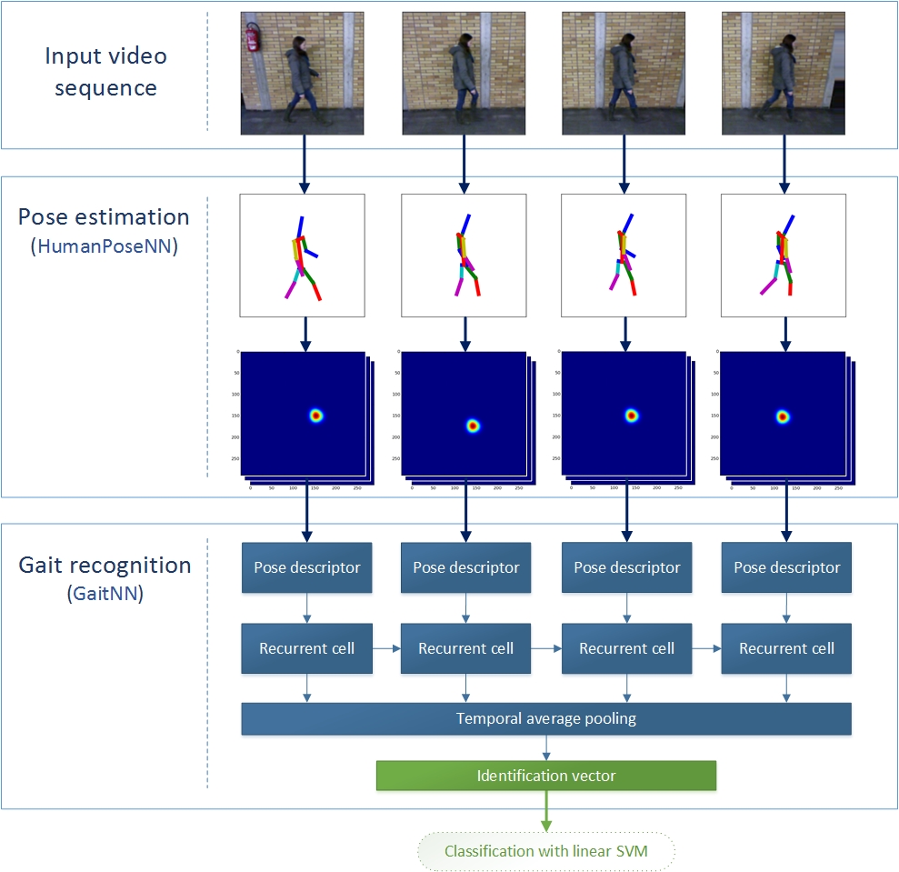
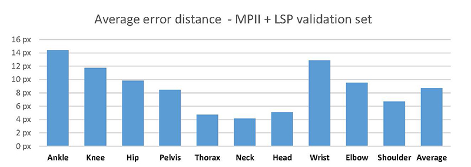
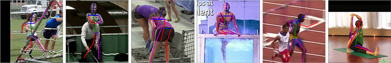
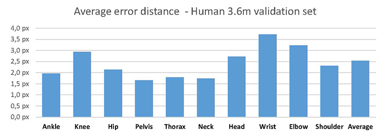
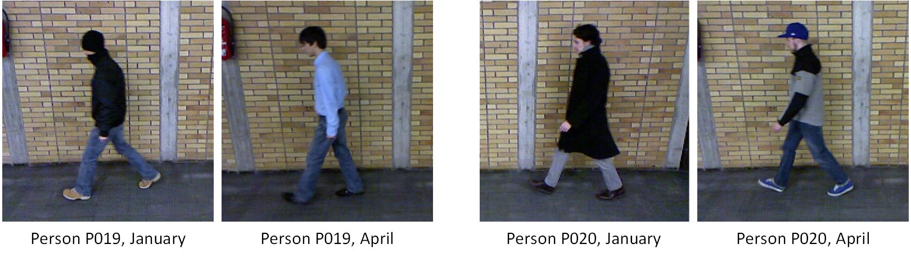
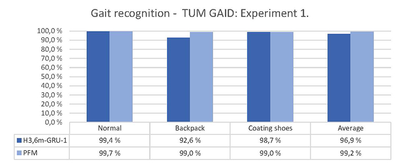
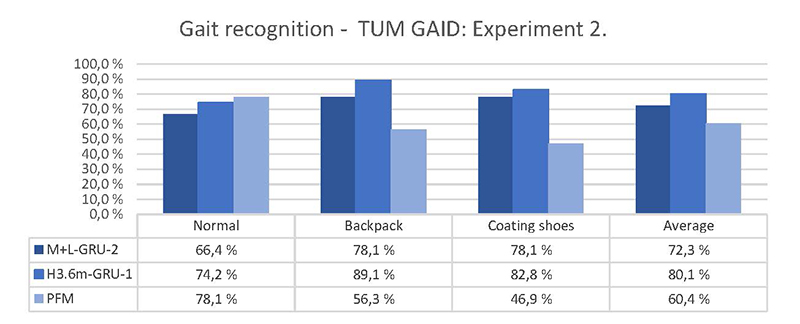

# DNN for gait recognition in TensorFlow

In this project you can find implementation of deep neural network for **people identification from video** by the characteristic of their **gait**. The processing is very robust against various covariate factors such as *clothing*, *carrying conditions*, *shoe types* and so on. Feel free to use this network in your project or extend it in some way.

## Requirements

The code was written in `Python 3.5`, but it is probably also compatible with other versions. 

### Python packages

- `TensorFlow 1.3` - [how to install](https://www.tensorflow.org/install/) (however, some parts of code may be compatible with lower version, report an issue if you would have any problems.)
- `numpy`, `scipy`, `PIL`

## Basic information about architecture

The network takes *raw RGB video frames* of a pedestrian as an input and produces one-dimensional vector - **gait descriptor** that exposes as an identification vector. The identification vectors from gaits of each two different people should be **linearly separable**. Whole network consists of two sub-networks connected in cascade - `HumanPoseNN` and `GaitNN`.

**Spatial features** from the video frames are extracted according to the descriptors that involve **pose of the pedestrian**. These descriptors are generated from the first sub-network - `HumanPoseNN` defined in `human_pose_nn` module. `HumanPoseNN` can be also used as a standalone network for regular **2D pose estimation problem** from still images (for more info see [this section](#pose-estimation)).

Responsibility of the second sub-network - `GaitNN` defined in `gait_nn` module is the further processing of the generated spatial features into one-dimensional **pose descriptors** with the use of a residual convolutional network. **Temporal features** are then extracted across these *pose descriptors* with the use of the multilayer recurrent cells - **LSTM** or **GRU**. All temporal features are finally aggregated with **Average temporal pooling** into one-dimensional **identification vector** with good discriminatory properties. As already mentioned in the text above, the human identification vectors are linearly separable with each other and can therefore be classified with e.g. **linear SVM**.



## Gait recognition

The dummy code bellow shows how to generate the identification vector form the input data `video_frames`. For the best results, all frames should include the **whole** person visible from the **profile view**. The person should be located approximately in the center of each frame. 

```python
# Initialize computational graphs of both sub-networks
net_pose = HumanPoseIRNetwork()
net_gait = GaitNetwork(recurrent_unit = 'GRU', rnn_layers = 2)

# Load pre-trained models
net_pose.restore('path/to/pose_checkpoint.ckpt')
net_gait.restore('path/to/gait_checkpoint.ckpt')

# Create features from input frames in shape (TIME, HEIGHT, WIDTH, CHANNELS) 
spatial_features = net_pose.feed_forward_features(video_frames)

# Process spatial features and generate identification vector 
identification_vector = net_gait.feed_forward(spatial_features)
```

## Pose estimation

The first sub-network `HumanPoseNN` can be also used as a standalone network for 2D **pose estimation problem**. This can be done in such a way:

```python
net_pose = HumanPoseIRNetwork()

# Restore pre-trained model
net_pose.restore('path/to/pose_checkpoint.ckpt')

# input_images should contain RGB images (299 x 299) to be processed.
# The images in batch should be stacked along the first dimension, so the shape of input_images 
# has to be (BATCH, 299, 299, 3)
coords_y, coords_x, probabilities = net_pose.joint_positions(input_images)
```
where `coords_y`, `coords_x` and `probabilities` stores estimated joint coordinates in **Y axis**, **X axis** and **probability** of each estimate, respectively. All these tensors have shape `(BATCH, 16)`, where the second dimension is the body joint. The order of the body joints in the second dimension is as follows:

```
1. right ankle 
2. right knee 
3. right hip
4. left hip
5. left knee
6. left ankle
7. pelvis
8. thorax
9. upper neck
10. head top *(in human3.6m - head middle)*
11. right wrist
12. right elbow
13. right shoulder
14. left shoulder
15. left elbow
16. left wrist
```

If you want to get raw heat-maps mapping dense probability distribution for each pixel in image, use method `heat_maps` instead of method `joint_positions`. This method returns heat maps with shape `(BATCH, HEIGHT, WIDTH, 16)`. 

#### Dummy pose estimation

If you run the script `dummy_pose_estimation.py`, the pose of a human in the dummy image */images/dummy.jpg* will be estimated and displayed in a new-created image */images/dummy_pose.jpg*. For doing this you must have the `matplotlib` package installed and have pre-trained model `MPII+LSP` stored in */models/MPII+LSP.ckpt* - for getting pre-trained models check the next section. The generated image in */images/dummy_pose.jpg* should look like this one:


Printed probabilities of each estimate:

```
right ankle : 85.80%
right knee : 80.27%
right hip: 85.40%
left hip: 80.01%
left knee: 83.32%
left ankle: 92.08%
pelvis: 88.84%
thorax: 96.41%
upper neck: 97.40%
head top: 88.81%
right wrist: 87.90%
right elbow: 88.85%
right shoulder: 91.30%
left shoulder: 93.63%
left elbow: 92.31%
left wrist: 94.24%
```

## Pre-trained models

### HumanPoseNN: **MPII + LSP**

**Download**: [MPII+LSP.ckpt](https://drive.google.com/file/d/1bNoZkuI0TCqf_DV613SOAng3p6Y0Si6a/view?usp=sharing)

The checkpoint `MPII+LSP.ckpt` was trained on images from [MPII](http://human-pose.mpi-inf.mpg.de) and [LSP](http://www.comp.leeds.ac.uk/mat4saj/lsp.html) database. In the graph below you can see the average distance between predicted and desired joints on a **validation set of about 6 000 images**.



#### The sample of correctly estimated poses


#### The sample of incorrectly estimated poses


### HumanPoseNN: **Human 3.6m**

**Download**: [Human3.6m.ckpt](https://drive.google.com/file/d/1lup13q5lTzsbrRZafpNbVF8uUyblMpZ3/view?usp=sharing) (action *walking*)

The checkpoint `Human3.6m.ckpt` was trained on the database [Human 3.6m](http://vision.imar.ro/human3.6m/description.php) and only on the **walking** sequences of peoples S1, S6, S7, S8, S9 and S11 (48 sequences). Person S5 (8 sequences) was used for a validation purposes and the average distance between predicted and desired joints is shown in the following graph. As you can see, errors are smaller compared to MPII+LSP. It is because desired poses in Human 3.6m was labeled more precisely using motion capture system, so the a trained network can more accurately estimate the human pose. The second reason is that Human 3.6m sequences are very monotonous and thus human pose estimation is less challenging. 



### GaitNN


We use the same standard TUM GAID experiments as described e.g. in [this paper](https://arxiv.org/abs/1601.06931) (section *Experimental results on TUM GAID*) from F.M. Castro et al. that currently achieve state of the art results. In short, there are 2 main experiments. The goal in the first one is to identify 305 people (100 training, 150 validation, 155 testing) using 10 gait sequences for each person. These sequences catch person in three different covariate conditions: **Normal** walk, walking with **backpack** and walking with **coating shoes**. However, the people on all of these video-sequences wear the same clothing. To address the various clothing conditions, there is the second experiment. The goal of the second experiment is to identify 32 peoples (10 training, 6 validation, 16 testing) using 20 gait sequences for each person - first 10 was taken in January and the other 10 in April. The people have different clothing, usual for respective season. 



The best performing model on the first experiment is `H3.6m-GRU-1` and on the second is `M+L-GRU-2`. The graphs bellow compares the performance of these models with already mentioned state of the art model [PFM](https://arxiv.org/abs/1601.06931) from F.M. Castro et al. The model `H3.6m-GRU-1` was trained only on the first experiment and on the second graph there is shown, how this model works on the validation set of the second experiment. As you can see, both models outperform PFM in the second experiment with a large margin. It means that these models are much more robust against clothing and time elapsed factors. 




**Download**:<br>
[H3.6m-GRU-1.ckpt](models/H3.6m-GRU-1.ckpt)<br>
[M+L-GRU-2.ckpt](models/M+L-GRU-2.ckpt)

The name describe used architecture (model-RNNcell-layers), so e.g. checkpoint `H3.6m-GRU-1.ckpt` should be loaded in this way:
```python
net_pose = HumanPoseIRNetwork()
net_gait = GaitNetwork(recurrent_unit = 'GRU', rnn_layers = 1)

# Load pre-trained models
net_pose.restore('./Human3.6m.ckpt')
net_gait.restore('./H3.6m-GRU-1.ckpt')
```
